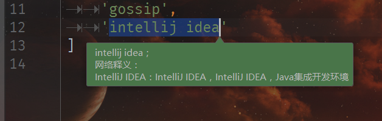

# A8Translate

一个无毒的 Android Studio/IntelliJ IDEA 翻译插件。

原作者看起来并不准备接受我的 pull request (可能是 GitHub 僵尸用户)，因此我决定使用 Kotlin 重写。

由于本插件面向中国用户，就不提供英文版 README 了。

在编辑器中选中词语， **Alt+T**，然后就可以看到翻译结果了。

大概是这样的：

## 特性

+ 本地化（保存查询结果，便于下次快速查询/无网络连接时查询）。
+ 忽略大小写
